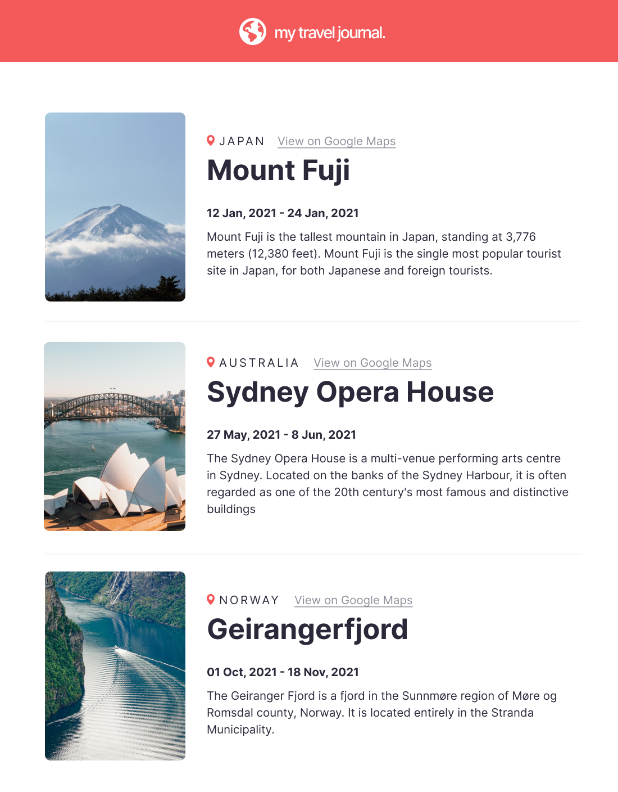

# Travel Journal (Scrimba React Course Project 4)[solo project]

Requirements: 
- Build a Travel Journal using React designed like this <a href="https://www.figma.com/file/QG4cOExkdbIbhSfWJhs2gs/Travel-Journal?node-id=0%3A1">Figma file</a>
- Data array in a separate .js file
    - Title, location, Googe Maps link, start date,  end date,description image URL
- Use .map() and props
- Styled & polished
 
 

